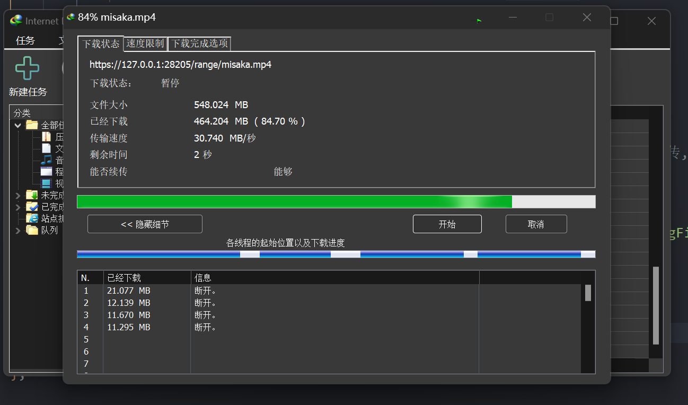

# 测试使用断点续传

- 启动: [使用`Transfer-Encoding`分块编码/`断点续传`传输文件的服务端](../examples/FileServer/FileServer.cpp)

## 一、wget测试

咱们使用`wget`测试:

1. 请求完整的文件

```sh
 root@Loli  ~ wget -c --no-check-certificate https://127.0.0.1:28205/test/range
--2025-03-13 00:12:11--  https://127.0.0.1:28205/test/range
Loaded CA certificate '/etc/ssl/certs/ca-certificates.crt'
Connecting to 127.0.0.1:28205... connected.
WARNING: The certificate of ‘127.0.0.1’ is not trusted.
WARNING: The certificate of ‘127.0.0.1’ doesn't have a known issuer.
The certificate's owner does not match hostname ‘127.0.0.1’
HTTP request sent, awaiting response... 200 OK
Length: 563873 (551K) [text/html]
Saving to: ‘range’

range                         100%[==============================================>] 550.66K  --.-KB/s    in 0.002s  

2025-03-13 00:12:11 (306 MB/s) - ‘range’ saved [563873/563873]
```

2. 删除文件的后面部分, 让wget从中断的地方继续下载 (模拟中断)

```sh
 root@Loli  ~ truncate -s 300K range
```

3. 继续请求完整的文件

```sh
 root@Loli  ~ wget -c --no-check-certificate https://127.0.0.1:28205/test/range
--2025-03-13 00:12:53--  https://127.0.0.1:28205/test/range
Loaded CA certificate '/etc/ssl/certs/ca-certificates.crt'
Connecting to 127.0.0.1:28205... connected.
WARNING: The certificate of ‘127.0.0.1’ is not trusted.
WARNING: The certificate of ‘127.0.0.1’ doesn't have a known issuer.
The certificate's owner does not match hostname ‘127.0.0.1’
HTTP request sent, awaiting response... 206 Partial Content
Length: 563873 (551K), 256673 (251K) remaining [text/html]
Saving to: ‘range’

range                         100%[+++++++++++++++++++++++++=====================>] 550.66K  --.-KB/s    in 0.001s  

2025-03-13 00:12:53 (456 MB/s) - ‘range’ saved [563873/563873]
```

可以发现它从中断的地方重新开始了, 而 **不是** 从头开始!

因此得证, 项目支持断点续传~

## 二、IDM测试

非常简单, 只需要点击下载即可:



> [!TIP]
> (图片是暂停的了, 已经测试了多次断开是可以继续的(断点续传嘛)) 目前服务器部署在VM上, 因此由于虚拟化、DEBUG运行、https等原因, 它的性能大大下降! (而且我的游戏本还没有插电源...)
>
> *基准: 我通过vscode拖拽上传这个mp4文件的速度是在 8 ~ 9 MB/s 左右*

## 三、aria2多线程下载测试

安装`aria2`:

```sh
sudo pacman -S aria2
```

启动程序, 然后多线程下载:

```sh
aria2c -x 16 -s 16 --check-certificate=false "https://127.0.0.1:28205/range/misaka.mp4"
```

实际运行结果:

```sh
 root@Loli  ~ aria2c -x 16 -s 16 --check-certificate=false "https://127.0.0.1:28205/range/misaka.mp4"

03/14 15:38:05 [NOTICE] Downloading 1 item(s)
[#4e7d4e 449MiB/548MiB(82%) CN:16 DL:458MiB]                                                                        
03/14 15:38:07 [NOTICE] Download complete: /root/misaka.mp4

Download Results:
gid   |stat|avg speed  |path/URI
======+====+===========+=======================================================
4e7d4e|OK  |   459MiB/s|/root/misaka.mp4

Status Legend:
(OK):download completed.
```

可以发现, 几乎是没有兼容性问题的, 大大滴正确! (同时也测试了多次在下载的时候ctrl+c取消下载, 即中断, 但是依旧可以成功下载 (断点续传的))

<details>
<summary>更多的运行输出:</summary>

```sh
# `-c`是指定断点续传
aria2c -c -x 16 -s 16 --check-certificate=false -o misaka.mp4.part "https://127.0.0.1:28205/range/misaka.mp4"
```

```sh
 root@Loli  ~ aria2c -c -x 16 -s 16 --check-certificate=false -o misaka.mp4.part "https://127.0.0.1:28205/range/misaka.mp4"

03/14 15:41:26 [NOTICE] Downloading 1 item(s)
^C
03/14 15:41:26 [NOTICE] Shutdown sequence commencing... Press Ctrl-C again for emergency shutdown.

03/14 15:41:26 [NOTICE] Download GID#8036614ece916072 not complete: /root/misaka.mp4.part

Download Results:
gid   |stat|avg speed  |path/URI
======+====+===========+=======================================================
803661|INPR|   362MiB/s|/root/misaka.mp4.part

Status Legend:
(INPR):download in-progress.

aria2 will resume download if the transfer is restarted.
If there are any errors, then see the log file. See '-l' option in help/man page for details.
 root@Loli  ~ ls
HXcode  mycpp  test_tmp  tmp  misaka.mp4.part  misaka.mp4.part.aria2  range  test.bin
 root@Loli  ~ aria2c -c -x 16 -s 16 --check-certificate=false -o misaka.mp4.part "https://127.0.0.1:28205/range/misaka.mp4"

03/14 15:41:33 [NOTICE] Downloading 1 item(s)
[#9de64b 540MiB/548MiB(98%) CN:13 DL:462MiB]                                                                        
03/14 15:41:34 [NOTICE] Download complete: /root/misaka.mp4.part

Download Results:
gid   |stat|avg speed  |path/URI
======+====+===========+=======================================================
9de64b|OK  |   448MiB/s|/root/misaka.mp4.part

Status Legend:
(OK):download completed.
```

> **操作说明**: 运行下载后, 马上 ctrl + c 断开了
>
> aria2c 记录了未完成的部分:
>
> ```sh
> Download GID#8036614ece916072 not complete: /root/misaka.mp4.part
> ```
>
> 服务器没有报错，aria2 也提示:
>
> ```sh
> aria2 will resume download if the transfer is restarted.
> ```
>
> 第二次使用 -c 继续下载:
>
> 下载从 98% 继续, 而不是从 0% 开始:
>
> ```sh
> 540MiB/548MiB(98%) CN:13 DL:462MiB
> ```
>
> 最终: `Download complete: /root/misaka.mp4.part`

</details>
